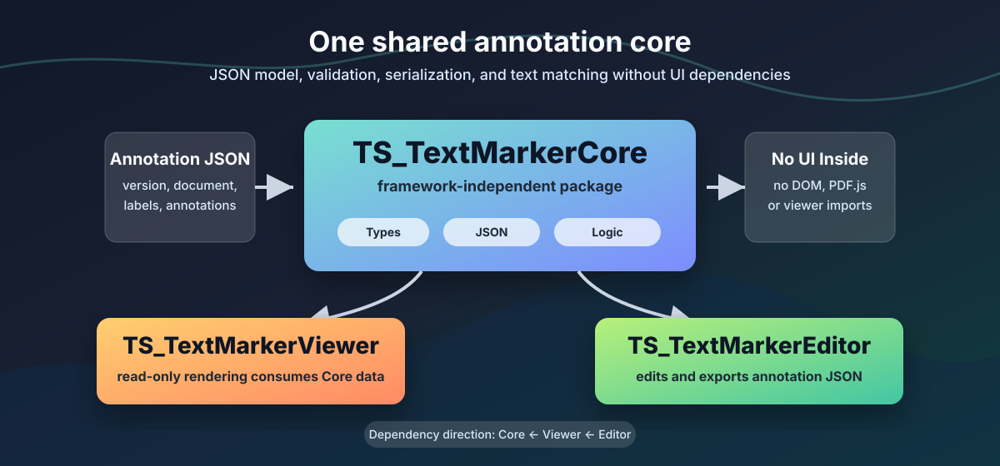

# TS_TextMarkerCore

<p align="center">
  
</p>

TS_TextMarkerCore definiert das gemeinsame Datenmodell fuer Viewer, Editor und spaetere TextMarker-Module. Das Package enthaelt keine Benutzeroberflaeche und keine Abhaengigkeit zu PDF.js, DOM APIs, Canvas oder konkreten Viewern.

```text
                    TS_TextMarkerCore
                           |
             +-------------+-------------+
             v                           v
    TS_TextMarkerViewer         TS_TextMarkerEditor
```

Der Core stellt nur Typen, JSON-Validierung, Serialisierung und reine Hilfsfunktionen bereit. Die Dependency-Richtung bleibt immer: Viewer und Editor verwenden den Core; der Core importiert niemals Viewer oder Editor.

## Installation

Aktuell aus GitHub:

```bash
npm install github:Datenflix007/TS_TextMarkerCore
```

Spaeter als npm-Package:

```bash
npm install @datenflix007/ts-text-marker-core
```

## AnnotationDocument

`AnnotationDocument` ist das zentrale JSON-Austauschformat:

```ts
import type {
  AnnotationDocument
} from "@datenflix007/ts-text-marker-core";

const document: AnnotationDocument = {
  version: "1.0",
  document: {
    id: "demo"
  },
  labels: [],
  annotations: []
};
```

Das Modell besteht aus:

- `version`: Datenformat-Version, aktuell `"1.0"`.
- `document`: Metadaten des annotierten Dokuments.
- `labels`: zentrale Label-Definitionen mit `id`, `name`, `color` und optionaler Beschreibung.
- `annotations`: einzelne Textannotationen, die per `labelId` auf ein Label verweisen.

Eine Annotation speichert den menschenlesbaren `quote` und optional Positionsinformationen:

- `occurrence`: n-tes Vorkommen des Quotes.
- `page`: Seitenbezug, besonders fuer PDFs.
- `start` / `end`: stabile Zeichenposition, `start` inklusive und `end` exklusiv.
- `boundingBox`: vorbereitete OCR-/Layout-Position fuer spaetere Erweiterungen.

Im JSON duerfen nur serialisierbare Daten vorkommen. Es gibt keine View-spezifischen Felder, DOM-Referenzen, `HTMLElement`-Referenzen, Canvas-Objekte oder PDF.js-Objekte.

## Validierung

```ts
import {
  validateAnnotationDocument
} from "@datenflix007/ts-text-marker-core";

const result =
  validateAnnotationDocument(document);

if (!result.valid) {
  console.error(result.errors);
}
```

Die Validierung prueft unter anderem Version, Dokument-ID, Array-Strukturen, eindeutige Label- und Annotation-IDs, Label-Referenzen, leere Quotes, `start`/`end`, `occurrence`, `page` und `boundingBox`-Werte.

## JSON Laden

```ts
import {
  parseAnnotationDocument
} from "@datenflix007/ts-text-marker-core";

const data =
  parseAnnotationDocument(json);
```

`parseAnnotationDocument` parst JSON, validiert das Ergebnis und wirft bei syntaktischen oder semantischen Fehlern eine aussagekraeftige Exception.

## JSON Speichern

```ts
import {
  serializeAnnotationDocument
} from "@datenflix007/ts-text-marker-core";

const json =
  serializeAnnotationDocument(data, {
    pretty: true
  });
```

## Suche

```ts
import {
  findTextOccurrences
} from "@datenflix007/ts-text-marker-core";

const occurrences =
  findTextOccurrences(
    text,
    "bellum"
  );
```

Die Suche ist standardmaessig case-insensitive und liefert Offsets im Originaltext zurueck. `wholeWord` kann aktiviert werden, wenn nur ganze Woerter zaehlen sollen.

## Annotation Aufloesen

```ts
import {
  resolveAnnotationRange
} from "@datenflix007/ts-text-marker-core";

const range =
  resolveAnnotationRange(
    text,
    annotation
  );
```

`resolveAnnotationRange` verwendet diese Prioritaet:

1. `start` und `end`
2. `quote` und `occurrence`
3. erstes Vorkommen von `quote`

Wenn keine Position aufgeloest werden kann, gibt die Funktion `null` zurueck.

## Textnormalisierung

```ts
import {
  normalizeText
} from "@datenflix007/ts-text-marker-core";

const normalized =
  normalizeText(text);
```

Standardwerte:

- `caseSensitive = false`
- `normalizeWhitespace = true`
- `trim = true`

Wichtig: Normalisierung kann Whitespace, Gross-/Kleinschreibung und dadurch unter Umstaenden Zeichenpositionen veraendern. Normalisierter Text hat nicht automatisch dieselben Offsets wie der Originaltext.

## Using TS_TextMarkerCore with TS_TextMarkerViewer

```ts
import type {
  AnnotationDocument
} from "@datenflix007/ts-text-marker-core";

import "@datenflix007/ts-text-marker-viewer";

const annotations: AnnotationDocument = {
  version: "1.0",
  document: {
    id: "demo"
  },
  labels: [],
  annotations: []
};

viewer.setAnnotationDocument(
  annotations
);
```

Der Core kennt den Viewer nicht. Der Viewer haengt vom Core ab. Der Core darf niemals den Viewer importieren.

Fuer den Viewer sind besonders diese Exporte relevant:

- `Annotation`
- `AnnotationDocument`
- `AnnotationLabel`
- `DocumentMetadata`
- `BoundingBox`
- `TextRange`
- `findTextOccurrences`
- `resolveAnnotationRange`
- `getAnnotationLabel`
- `validateAnnotationDocument`

## Using TS_TextMarkerCore with TS_TextMarkerEditor

```text
TS_TextMarkerEditor
        |
        +-- verwendet TS_TextMarkerCore
        +-- verwendet TS_TextMarkerViewer
```

Der Editor wird spaeter `AnnotationDocument` laden, Annotationen erzeugen, veraendern, loeschen und wieder exportieren. Diese Editorfunktionen gehoeren bewusst nicht in den Core. Der Core stellt nur die Datenstruktur und allgemeine Logik bereit.

## Formatversionen

Aktuell akzeptiert der Core nur:

```json
{
  "version": "1.0"
}
```

Unbekannte Versionen wie `"9.0"` werden nicht stillschweigend akzeptiert. Spaetere Migrationen koennen auf dieser Versionsmarke aufbauen, zum Beispiel `1.0 -> 1.1 -> 2.0`. Eine echte Migration ist noch nicht implementiert.

## Oeffentliche API

```ts
export type {
  Annotation,
  AnnotationDocument,
  AnnotationLabel,
  BoundingBox,
  DocumentMetadata,
  TextRange,
  TextOccurrence,
  ValidationResult,
  ValidationError
};

export {
  validateAnnotationDocument,
  parseAnnotationDocument,
  serializeAnnotationDocument,
  findTextOccurrences,
  resolveAnnotationRange,
  getAnnotationLabel,
  getLabelById,
  createAnnotationId,
  normalizeText
};
```

## Entwicklung

```bash
npm install
npm run build
npm test
npm run check
```

`npm run check` baut das Package, fuehrt die Vitest-Suite aus und prueft anschliessend einen minimalen Consumer-Import ueber den Package-Namen.
